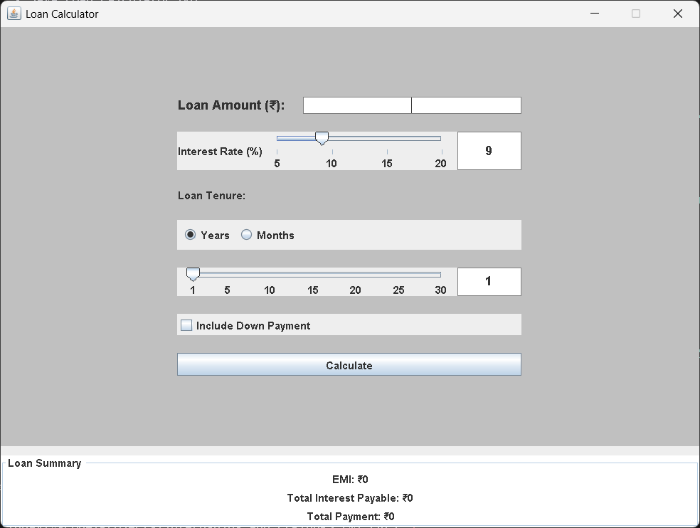
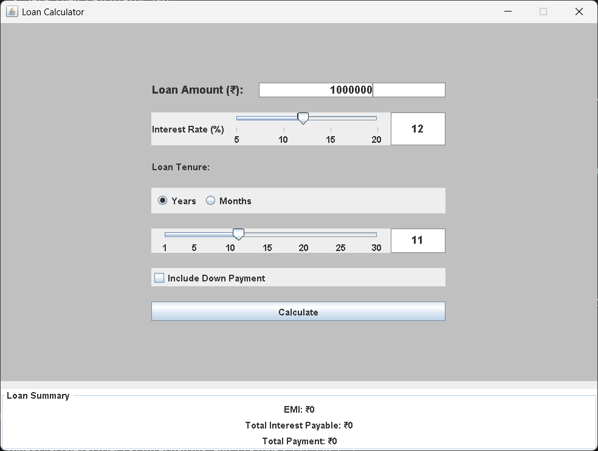
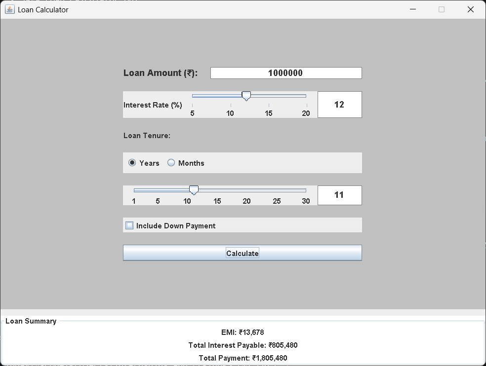
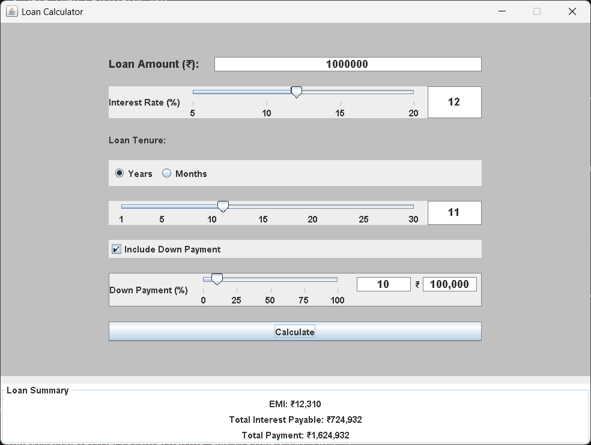

# Java Loan Calculator GUI

A comprehensive Java desktop application for calculating loan EMI (Equated Monthly Installment) with an interactive graphical user interface. Built using Java Swing and Object-Oriented Programming principles.

## 🚀 Features

- **Interactive GUI** with real-time sliders for loan parameters
- **EMI Calculation** with accurate mathematical formulas
- **Down Payment Support** with percentage-based calculations
- **Flexible Tenure Options** (Years/Months)
- **Real-time Updates** as you adjust parameters
- **Input Validation** with error handling
- **Professional UI** with clean, intuitive design

## 📋 Requirements

- Java 8 or higher
- Java Swing support
- No additional dependencies required

## 🛠️ Installation & Setup

1. **Clone the repository:**
   ```bash
   git clone https://github.com/udaykumar0515/java-loan-calculator-gui.git
   cd java-loan-calculator-gui
   ```

2. **Compile the application:**
   ```bash
   javac LoanCalculatorGUI.java
   ```

3. **Run the application:**
   ```bash
   java LoanCalculatorGUI
   ```

## 📸 Screenshots

### Main Application Interface

*Main application window showing the complete loan calculator interface with all input fields, sliders, and result display area.*

### Interactive Sliders in Action

*Demonstration of the interactive sliders for interest rate, loan tenure, and down payment percentage with real-time value updates.*

### Calculation Results Display

*Example calculation results showing EMI, total interest payable, and total payment for a sample loan scenario.*

### Down Payment Feature

*Interface showing the down payment option enabled with percentage slider and calculated down payment amount display.*

## 💡 How to Use

1. **Enter Loan Amount** - Input the principal loan amount
2. **Set Interest Rate** - Use the slider to adjust interest rate (5-20%)
3. **Choose Tenure** - Select between Years or Months
4. **Set Loan Tenure** - Use the slider to set loan duration
5. **Optional Down Payment** - Check the box and set percentage if applicable
6. **Calculate** - Click the Calculate button to see results

## 📊 What You'll See

The calculator displays:
- **EMI** (Equated Monthly Installment)
- **Total Interest Payable** over the loan term
- **Total Payment** (Principal + Interest)

## 🎯 Use Cases

Perfect for calculating:
- **Home Loans** - Mortgage planning and analysis
- **Car Loans** - Vehicle financing calculations
- **Personal Loans** - Quick EMI estimates
- **Educational Loans** - Student loan planning
- **Any EMI-based loan** scenario

## 🏗️ Project Structure

```
java-loan-calculator-gui/
├── LoanCalculatorGUI.java    # Main application file
├── .gitignore               # Git ignore rules
├── README.md               # Project documentation
└── lib/                    # External libraries (if any)
    ├── jcommon-1.0.23.jar
    └── jfreechart-1.5.3-javadoc.jar
```

## 🔧 Technical Details

- **Language:** Java
- **GUI Framework:** Java Swing
- **Architecture:** Object-Oriented Design
- **Calculation Method:** Standard EMI formula
- **Input Validation:** Number format checking
- **Error Handling:** User-friendly error messages

## 📈 EMI Formula

The application uses the standard EMI calculation formula:

```
EMI = [P × R × (1+R)^N] / [(1+R)^N - 1]
```

Where:
- P = Principal loan amount
- R = Monthly interest rate (Annual rate / 12 / 100)
- N = Loan tenure in months

## 🤝 Contributing

Contributions are welcome! Please feel free to submit a Pull Request.

## 📝 License

This project is open source and available under the [MIT License](LICENSE).

## 👨‍💻 Author

**Uday Kumar**
- GitHub: [@udaykumar0515](https://github.com/udaykumar0515)

## 📞 Support

If you have any questions or suggestions, please open an issue on GitHub.

---

⭐ **Star this repository if you found it helpful!**
